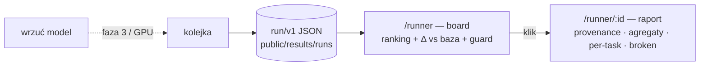
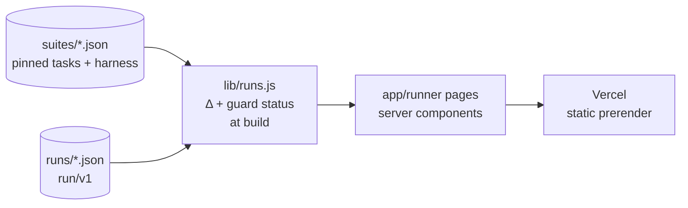

# Benchmark Runner

Point at a model, get comparable scores. One pinned suite, one harness, one base
anchor — so numbers can actually sit next to each other. Detailed spec:
[BENCHMARK_RUNNER_DESIGN.md](./BENCHMARK_RUNNER_DESIGN.md).

## Idea

The bake-off ("which base do we start from?") and the candidate report ("did last
night's training beat base, what broke?") are the **same view** over one object —
a **run** (model × suite → absolute scores + Δ vs base + provenance). Bake-off =
many runs, lineage off. Candidate report = one run, lineage on. Open suite only
(public datasets, no contamination risk); private/Tier-A diagnostics come later.

## User stories

- **Wybór bazy** — jako badacz widzę modele bazowe na jednym rankingu, żeby wiedzieć *od czego zacząć*.
- **Keeper?** — po treningu widzę kandydata vs baza (Δ per task) + co się zepsuło.
- **Porównywalność** — ufam liczbom, bo jeden harness i jedna *wersja* suite; dwa protokoły (generatywny / MCQ) nigdy nie mieszane.
- **Guardy** — jednym spojrzeniem widzę, czy model nie zepsuł angielskiego (zielony/czerwony).

## Flow

Dziś runy są wrzucane ręcznie jako statyczny JSON; runner/GPU wypełnia je później bez zmian we froncie.

## Architecture

- **Suite** = wersjonowany spec (`open-pl-v1`); liczby porównywalne tylko w obrębie wersji.
- **Run** = jeden plik `run/v1`; `base` wskazuje kotwicę do Δ; `demo:true` = dane poglądowe.
- **lib/runs.js** liczy Δ i guardy przy buildzie — strony to czyste server-components, zero backendu.

## Status

Front + dane poglądowe gotowe (kandydat = realny pomiar z `image.png`; baza/Bielik = placeholder).
**Później:** realny harness + runner GPU, backend/submisja, Tier-A (diagnostyka prywatna + werdykt „keeper").
